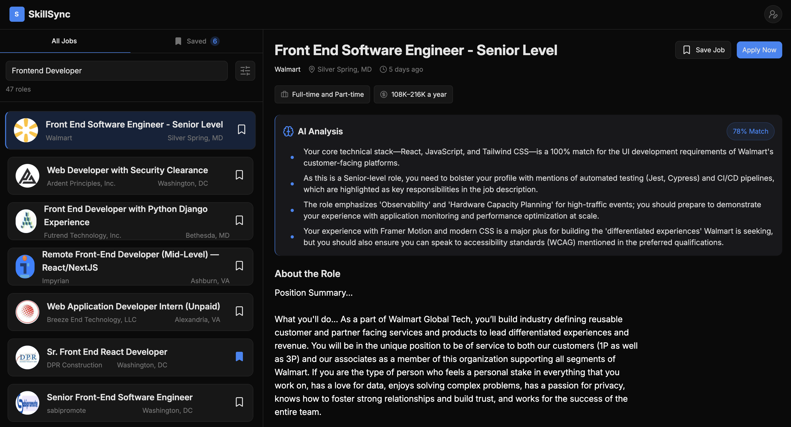

# SkillSync: AI-Powered Career Matching

Stop Guessing. Start Matching. SkillSync is a high-performance landing page and dashboard designed to bridge the gap between job seekers and employer expectations using the power of Gemini AI.

## 🚀 The Product

SkillSync isn't just a job board; it's a strategic tool that analyzes the semantic context of your profile against live job data to provide actionable insights.

- **Real-Time Discovery**: Tap into live job data via JSearch API with advanced filtering for role and location.

- **Deep AI Analysis**: Get an instant match score and personalized advice on how to tailor your profile for specific roles.

- **Privacy-First**: Your professional profile is processed locally within your session context to ensure maximum data privacy.

## 🏗️ Technical Architecture

Following a "Product-First" and "Architect" mindset, the application is built on a high-performance stack designed for scale and speed.

### Core Stack

- **Frontend**: React & Tailwind CSS for a snappy, responsive, and accessible UI.

- **Intelligence**: Gemini 3 Flash for high-speed semantic analysis and career reasoning.

- **Data**: JSearch API for real-time access to global job market indices.

- **Animations**: Framer Motion for purposeful, high-end micro-interactions.

## Performance Strategies

- **Domain-Driven State**: Optimized state management using separate contexts (`JobsContext` and `UserContext`) to ensure zero wasted re-renders across the application.

- **Bundle Optimization**: Implemented code-splitting via dynamic imports and `React.lazy`, reducing the initial bundle size from 740KB+ to a lightweight initial load.

- **Responsive UX**: Custom-built mobile navigation and adaptive layouts using the "Layout Shell" strategy and keyed Suspense boundaries for instant feedback.

## Getting Started

To run this project locally:

1. Clone the repository: `git clone git@github.com:YuzStack/65_SkillSync.git`
2. Install dependencies: `npm install`
3. Environment Variables: Create a `.env` file and add your API keys
   `VITE_GEMINI_API_KEY=your_key`\
   `VITE_JSEARCH_API_KEY=your_key`

4. Start the development server: `npm run dev`
